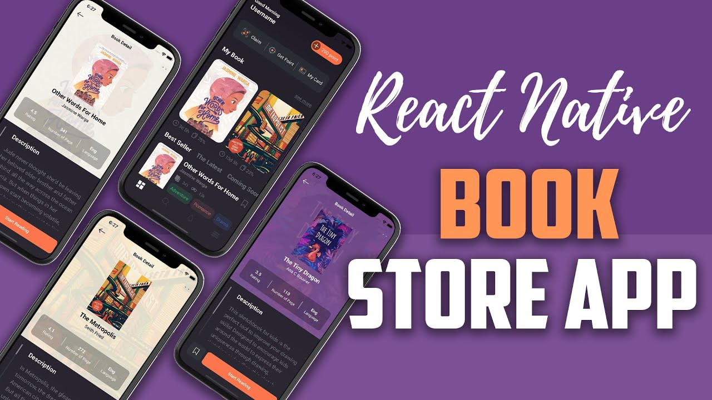

# BookStoreApp-ReactNative

Website for a video lesson for practicing practical skills in working in ReactNative. 
In practice, was created a beautiful bookstore website with a beautiful design from Piko on Dribbble

Link to the lesson - <a href="https://www.youtube.com/watch?v=PEI38Pa8ZYM&list=PLS1akX7gZoxEjaZKrEoiIF-uZLj_m2vqh&index=9">here</a>

<h3>🌠 Initial commands:</h3>

$ npx create-expo-app BookStore

$ cd BookStore

$ npm instal react-native link

// my practical work